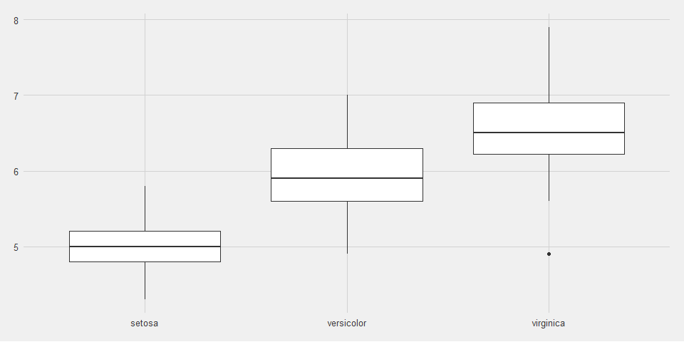
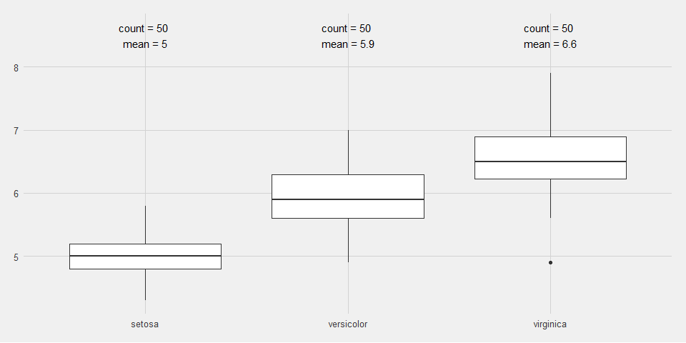
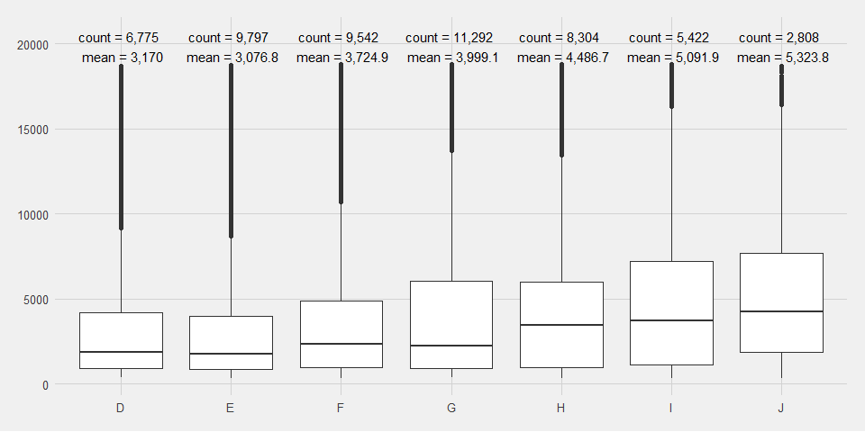

# Introduction

[Boxplots](https://en.wikipedia.org/wiki/Box_plot) are extremely useful to learn more about any given dataset. Basically, it allows you to compare a continuous and a categorical variable, that includes information about distribution and statistics, such as the median. As an example, let us explore the **Iris** dataset:


```r
kable(head(iris, 3))
```


 Sepal.Length   Sepal.Width   Petal.Length   Petal.Width  Species 
-------------  ------------  -------------  ------------  --------
          5.1           3.5            1.4           0.2  setosa  
          4.9           3.0            1.4           0.2  setosa  
          4.7           3.2            1.3           0.2  setosa  

Let's say you want to know more about the variable `Sepal.Length`. One way to do this would be to look at its statistics.


```r
summary(iris$Sepal.Length)
```

```
##    Min. 1st Qu.  Median    Mean 3rd Qu.    Max. 
##   4.300   5.100   5.800   5.843   6.400   7.900
```

If you want to look at the variable `Sepal.Length` and differentiate by another variable - let's say `Species` you could summerize it as such:


```r
kable(
  iris %>% 
    group_by(Species) %>% 
    summarize(
      mean = mean(Sepal.Length),
      count = n())
)
```


Species        mean   count
-----------  ------  ------
setosa        5.006      50
versicolor    5.936      50
virginica     6.588      50

A *visual* way of exploring the data is to use a boxplot. It shows you the distribution, the median as well as the upper and lower quartile.  


```r
ggplot(iris, aes(Species, Sepal.Length)) + 
  geom_boxplot() +
  theme_fivethirtyeight()
```

<!-- -->

# Challenge

The only missing information in a boxplot for me is the count of observation by category and the mean. I will try to show a way to add this information to the plot as convinient as possible.

# One way to add number and mean information to a boxplot

## First attempt

I will make use of the `stat_summary` function. It allows to *Summarise y values at unique/binned x* (cf. [reference](https://ggplot2.tidyverse.org/reference/stat_summary.html)). 

`stat_summary` expects a function that computes necessary informations to display. I will call this function `stat_box_data`. As input variables it expects the `y` variable - basis for computation. The other input variable is the `upper_limit`, which is somewhat a limitation that we need to provide it. It basically is the value to *position* the text on top of the boxes and is dependent on the y-variable.


```r
stat_box_data <- function(y, upper_limit = max(iris$Sepal.Length) * 1.15) {
  return( 
    data.frame(
      y = 0.95 * upper_limit,
      label = paste('count =', length(y), '\n',
                    'mean =', round(mean(y), 1), '\n')
    )
  )
}
```

This basically means, that for each plot it is necessary to adapt it. If you know of a better way to do it, please let me know, seriously!

We may know use the function `stat_box_data` in the `ggplot` call. 


```r
ggplot(iris, aes(Species, Sepal.Length)) + 
  geom_boxplot() +
  stat_summary(
    fun.data = stat_box_data, 
    geom = "text", 
    hjust = 0.5,
    vjust = 0.9
  ) + 
  theme_fivethirtyeight()
```

<!-- -->

## Additional tweaks to format a thousands separator

In case you want to explore variables with a higher number, i.e., above thousand, you may want to add a *thousands separator*. For this, I add a formatter in the function `stat_box_data`. Also, I make use of another dataset for this.


```r
stat_box_data <- function(x, upper_limit = max(diamonds$price) * 1.15) {
  return( 
    data.frame(
      y = 0.95 * upper_limit,
      label = paste('count =', 
                    format(length(x), big.mark = ",", decimal.mark = ".", scientific = FALSE), 
                    '\n',
                    'mean =', 
                    format(round(mean(x), 1), big.mark = ",", decimal.mark = ".", scientific = FALSE))
    )
  )
}
```

This will result in the following plot:


```r
ggplot(diamonds, aes(color, price)) + 
  geom_boxplot() +
  stat_summary(
    fun.data = stat_box_data, 
    geom = "text", 
    hjust = 0.5,
    vjust = 0.9
  ) + 
  theme_fivethirtyeight()
```

<!-- -->


# Conclusion

By adding `stat_summary()` to the `ggplot` call and providing the `stat_box_data` function to provide what information to display it is easily possible to have additional information on the boxplot for data analysis.

One drawback is that the function `stat_box_data` is dependent on the maximum value of a given continuous variable, and hence, need to be adapted for each dataset or variable to explore.

Please feel free to reach out to me if you have ideas to improve this solution!

All the best,
Gregor


